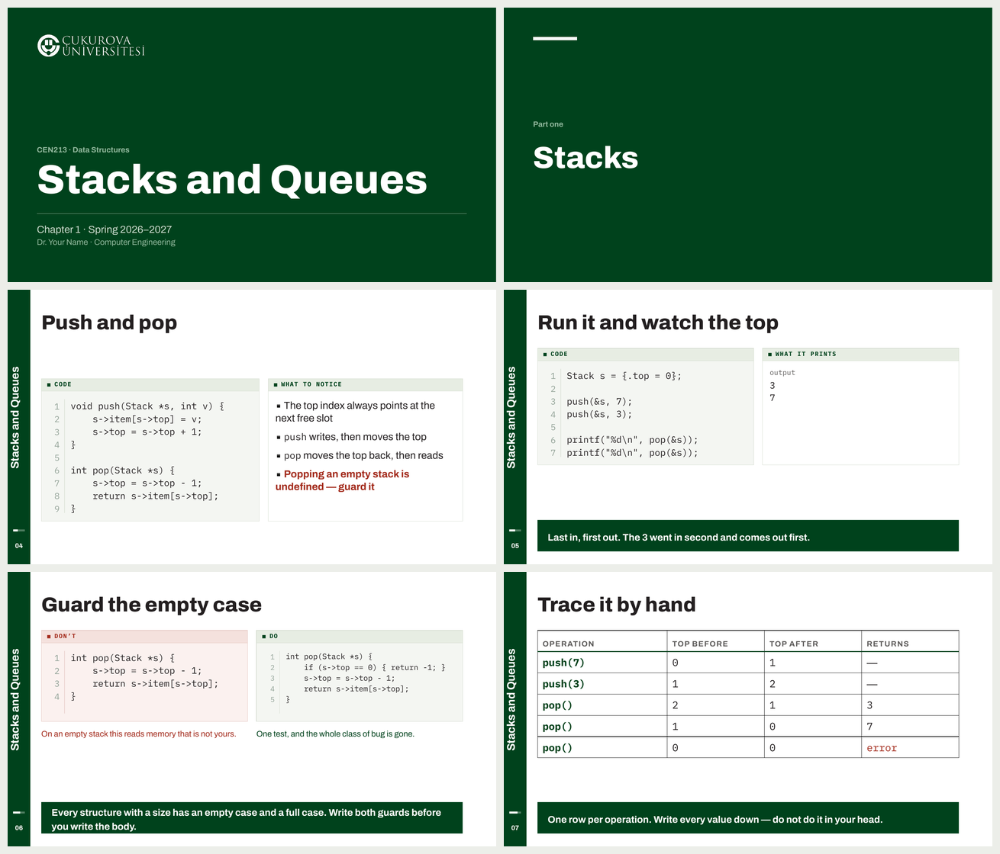
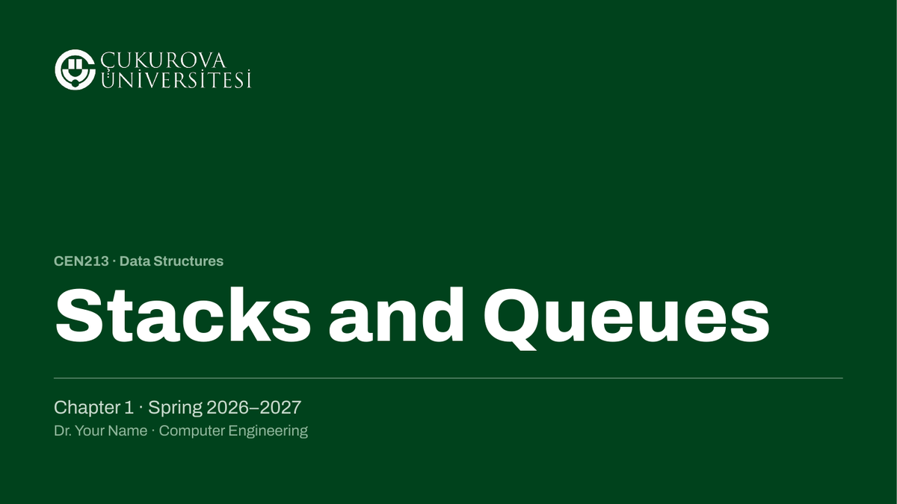
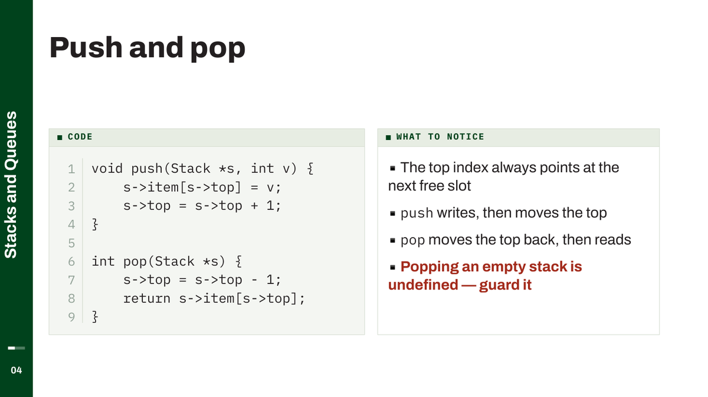
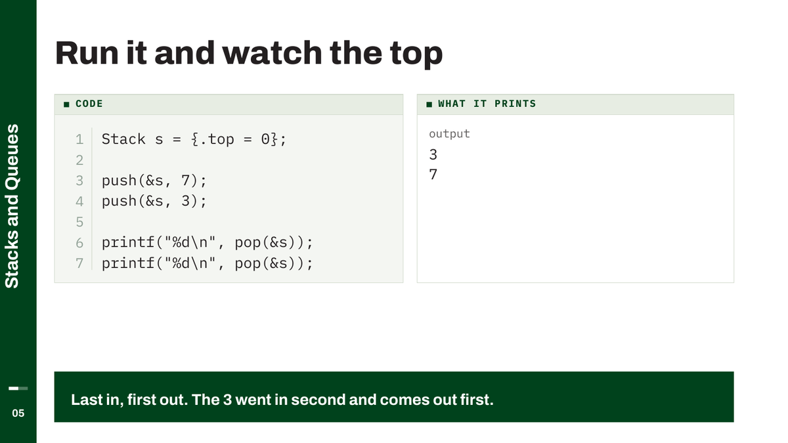
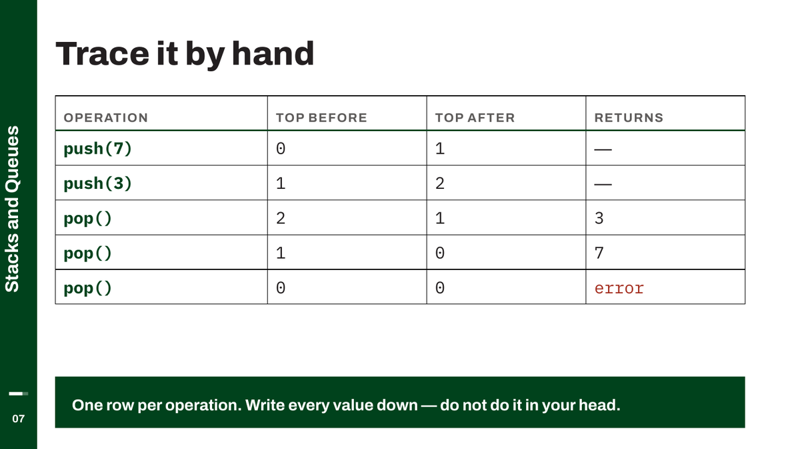
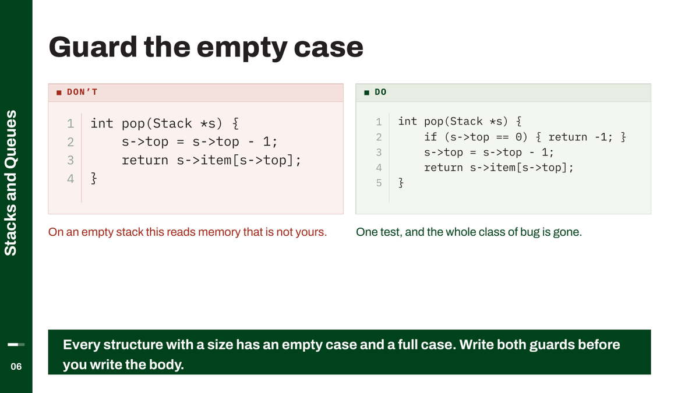

# CUDeck

A lecture-slide theme in the Çukurova Üniversitesi identity, and a small Python
library for building decks with it. You write the teaching material; the theme
decides what it looks like and tells you when it does not fit.



<sub>Every image in this README is a slide from `examples/data_structures.py` —
run it and you get them.</sub>

Decks are PowerPoint files, built by a script rather than by dragging boxes.
That means a colour or a type size changes in one place and every chapter
follows, speaker notes live in the same file as the slide they belong to, and
the build refuses to let text quietly overflow.

`docs/design.html` is the full design document — open it in a browser for the
specimens, the palette, and the reasoning behind the type.

---

## What it looks like

**Structural slides go full-bleed green.** The opener and the part dividers.



**Content slides stay white behind a slim green spine** carrying the chapter
title, a progress bar and the slide number, so a student who looks up
mid-lecture knows where they are.



**Code sits in a bordered panel** with a labelled header strip and a
line-number gutter you can point at out loud — "look at line three" beats
pointing at the screen. The grid lets a listing sit beside what it prints.



**Tables and trace tables** carry the material that is neither prose nor code —
the hand-trace especially, which is the skill that earns marks in an exam.



**Wrong code is red, right code is green**, and never only by colour: the
panels are labelled *Don't* and *Do*, because red and green together are the
hardest pair for the commonest colour blindness.



Body text is 28 pt and code 18 pt. Both survive the back row of a large
lecture theatre, which is the whole point of the type scale.

---

## Install

```bash
git clone git@github.com:brsata/cudeck.git
cd cudeck
pip install -e .
sh tools/install_fonts.sh          # once per machine
```

`install_fonts.sh` fetches **Archivo** and **IBM Plex Mono**. Both are SIL Open
Font License 1.1 — free to install, bundle and embed — but neither ships with
macOS or Windows, so this has to be run on every machine that opens or presents
a deck. Without them PowerPoint substitutes silently and the deck looks almost,
but not quite, right.

For rendering and checking (optional, but see *Checking your work*):

```bash
brew install --cask libreoffice
pip install -e '.[tools]'
```

---

## A deck, start to finish

```python
import cudeck as cu
from cudeck import *

cu.course(code="CEN213", title="Data Structures",
          term="Spring 2026–2027", lecturer="Dr. Your Name",
          department="Computer Engineering",
          books=[("Data Structures and Algorithm Analysis in C",
                  "Mark Allen Weiss", "2nd edition, Pearson, 1996")])

prs = new_deck()
chapter(prs, "Stacks and Queues")        # runs down the spine of every slide

title_slide(prs, "Stacks and Queues", chapter="Chapter 1", notes="""
Speaker notes go here. They are the part that does the teaching, so write them
as if you were talking.
""")

bullets_slide(prs, "What you will be able to do after today", [
    "Say what a stack is, and how it differs from a queue",
    "Push and pop by hand, and predict the result",
], notes="Read the last one slowly; it is where the marks go.")

section_slide(prs, "Part one", "Stacks")

code_notes(prs, "Push and pop", """void push(Stack *s, int v) {
    s->item[s->top] = v;
    s->top = s->top + 1;
}""", [
    "The top index points at the next free slot",
    "`push` writes, then moves the top",
    ("Popping an empty stack is undefined — guard it", cu.ERROR),
], "Trace three pushes and two pops on the board first.")

references_slide(prs)
finish(prs, "01_Stacks.pptx")
```

`examples/data_structures.py` is that deck in full — run it and look at what
comes out.

### The course description

`course(...)` is said once and supplies the line above every title headline, the
term and byline beneath it, and the whole References slide. A chapter script
then only says what its own chapter is.

With more than one deck, put it in its own module and import it:

```python
# cen213.py
import cudeck as cu
cu.course(code="CEN213", title="Data Structures", ...)
```

```python
# build_01.py
import cudeck as cu
from cudeck import *
import cen213          # noqa: F401 — describes the course
```

Change the academic year in that one file and every title slide follows.

---

## The slide builders

Each returns the slide, so you can keep adding to it.

| | |
|---|---|
| `title_slide(prs, title, chapter=…)` | full-bleed green opener |
| `section_slide(prs, kicker, title)` | full-bleed green part divider |
| `content_slide(prs, title)` | spine + title; everything else goes on top |
| `bullets_slide(prs, title, items)` | 28 pt body, steps down if it must |
| `code_notes(prs, title, code, items, notes)` | code panel beside observations |
| `table_slide(prs, title, headers, rows)` | |
| `references_slide(prs)` | built from the course's book list |

And the pieces they are built from, for a slide you lay out yourself:

| | |
|---|---|
| `panel(slide, left, top, w, h, label=…)` | a bordered panel; returns its inner box |
| `code_panel(slide, code, left, top, w)` | code, with a line-number gutter |
| `code_two_col(slide, code, top)` | a long listing in two columns |
| `notes_panel(slide, items, left, top, w, h)` | bullets inside a panel |
| `output_panel(slide, runs, left, top, w, h)` | what the program printed |
| `defs_panel(slide, pairs, left, top, w, h)` | a term, then what it means |
| `dont_do(slide, wrong, right, top)` | the red/green pitfall pairing |
| `callout(slide, text)` | the closing line, pinned to the foot |
| `bullet_list`, `label`, `caption`, `table`, `badge`, `pipeline` | |

### Layout

```python
(left, lw), (right, rw) = cols(1.15, 1)     # two columns, the first wider
panel(slide, left, BODY_TOP, lw, Inches(3))
```

Use `MARGIN`, `BODYW`, `BODY_TOP`, `BODY_BOTTOM` and `cols(...)`; never measure
from the slide edge. The content band is 0.92″ in and 11.5″ wide, with the
spine occupying the 0.62″ to its left.

### Writing text

Anything in `` `backticks` `` is set in the code face. Use it for code in prose:

```python
"Use `switch`, and explain why every `case` needs a `break`"
```

This matters more than it looks: Archivo's ampersand is calligraphic, so `&&`
set as body text does not look like the operator students type. Table cells take
a one-tuple instead — `("a < b",)`.

Colours: `GREEN`, `INK`, `GREY` from the identity; `ERROR` for code that is
wrong; `PANEL`, `PANEL_HEAD`, `PANEL_LINE` for panels. `ERROR` is reserved — it
stops meaning anything if it gets used for emphasis.

---

## Checking your work

**Every build prints a fit report.** Anything listed is content that does not
fit the space it was given: code too wide or too tall for its panel, a notes
panel running past the body, bullets that had to drop below 28 pt. An empty
report means every slide fits at the intended sizes.

```
$ python build_06.py
saved: 06_Selection.pptx
slides: 34
  fit: Case study: code shrank to 12 pt to fit — worth splitting
```

**`tools/render.sh` is the render to trust.** It drives LibreOffice, so what
comes out is what a PowerPoint-compatible renderer makes of the file, and it
prints which faces actually ended up in the PDF:

```bash
sh tools/render.sh 06_Selection.pptx
# 34 slides in /tmp/cudeck/06_Selection/
# fonts used: Archivo-Bold, Archivo-ExtraBold, Archivo-Regular, IBMPlexMono-Regular
```

If that list contains anything else, a font is missing and the deck is lying to
you.

**`tools/audit.py`** reads finished files and reports text running off the slide
or sitting on top of other text:

```bash
python tools/audit.py *.pptx
```

Overlaps below about 0.5″ are usually a label box touching its neighbour — a
`label()` box is 0.36″ tall while its text is nearer 0.2″. Larger ones are real.

**`tools/preview.py`** draws the shapes directly to PNG without LibreOffice.
It is fast and approximate: use it between edits, and `render.sh` before you
believe anything.

---

## Three things that will bite you

**Line spacing is set in absolute points, never as a multiple.** PowerPoint
multiplies a ratio by the *font's* line height, not by the point size, so
`line_spacing = 1.4` at 18 pt gives about 33 pt, not 25. Every height formula in
the theme assumes points. Get this wrong and panels come out a third too short —
which looks fine in `preview.py` and wrong in PowerPoint.

**Line numbers are on for C listings of three lines or more**, off for console
transcripts, and off if numbering would push the code below 13 pt. A chapter
whose listings are pseudocode already numbers its own steps, so it turns them
off with `cu.CODE_NUMBERS[0] = False`.

**The theme fonts are set on the deck itself**, not only on each run. Any run
that does not name a typeface inherits the theme, which in a stock python-pptx
file is Calibri; `new_deck()` repoints it so a stray hand-built textbox cannot
quietly render in the wrong face.

---

## The palette and the type

| | |
|---|---|
| Green | `#00421C` — Pantone 357 C |
| Black | `#231F20` |
| Grey | `#5E5C5B` |
| Headlines | Archivo ExtraBold |
| Body | Archivo |
| Code | IBM Plex Mono |
| Marks | the seal and the horizontal lockup, in `cudeck/media/` |

Those three colours are the university's. The rest are additions for the
screen — the pale panel fill, the lifted green `#8FB79C` that reads on a green
ground, the error red `#A32B1C` — and the palette block at the top of
`cudeck/theme.py` says which is which.

To adapt the theme for somewhere else, change that block and replace the files
in `cudeck/media/`; `logo()` and `seal()` read whatever is in that folder.

`docs/design.html` sets out the reasoning, and `docs/alternatives.html` shows
the four directions this was chosen from.

---

## Redesigning an existing deck with Claude Code

Most decks worth rebuilding already exist as PowerPoint files, made by hand over
several years. The material is good; the layout is whatever PowerPoint made
easy at the time.

**Start by extracting what you have.** The slides are worth rethinking; the
speaker notes are worth keeping exactly, because they took the longest to write
and nobody can reconstruct them:

```bash
python tools/extract.py old_slides/*.pptx -o content/
```

That writes one Markdown file per deck — every slide's text, its tables, and its
notes verbatim.

**Then point Claude Code at the repository and the extracted content.** The
`CLAUDE.md` at the root is picked up automatically and tells it how to build,
render and check. A prompt that works:

> Read `content/lecture1.md`. Rebuild it as a CUDeck script using the builders
> in the README — one `content_slide` per slide, `code_notes` where a listing
> has commentary beside it, `dont_do` for anything showing a wrong and a right
> version. Carry every speaker note across **verbatim**; do not summarise or
> rewrite them. Build it, run `tools/render.sh`, and show me the contact sheet.

**Insist on three things**, because they are where this goes wrong:

1. **Notes verbatim.** A model asked to "port" a deck will quietly improve the
   prose. Say *verbatim*, and spot-check a long note against the original.
2. **Look at the render, not the fit report.** An empty fit report means the
   content fits the space it asked for; it does not mean the slide is right. The
   contact sheet takes ten seconds to read and catches what the numbers cannot.
3. **Let slides split.** When a slide is too full, the fix is two slides, not
   smaller type. If the fit report says something shrank, that is the signal.

**Expect the content to need decisions, not just conversion.** Rebuilding is a
good moment to notice that one slide is really three, that a table has been
doing the work of a diagram, or that a listing nobody can read at the back has
been there for years. Those are the parts to do by hand.

A rough shape for a chapter, once the content is extracted: an hour of
back-and-forth, most of it spent looking at renders rather than writing code.

## Licence

MIT — see [LICENSE](LICENSE). Two things in the repository are not covered by
it:

- **The university marks** in `cudeck/media/` are the property of Çukurova
  Üniversitesi, reproduced from its *Kurumsal Kimlik* (2015) for use in
  university teaching material. Adapting this theme for another institution
  means replacing them — `logo()` and `seal()` read whatever is in that folder.
- **The typefaces** are not redistributed here. `tools/install_fonts.sh` fetches
  Archivo and IBM Plex Mono from their own repositories, along with their SIL
  Open Font License 1.1 files.

## Layout of the repository

```
cudeck/
  cudeck/
    theme.py          the theme: palette, type scale, geometry, slide builders
    media/            the university marks, cut from the identity PDF at 400 dpi
  tools/
    install_fonts.sh  Archivo + IBM Plex Mono, per machine
    render.sh         pptx → PDF → PNG through LibreOffice
    preview.py        pptx → PNG directly; fast, approximate
    audit.py          overlap and overflow check on built files
    extract.py        an existing deck → Markdown, notes and all
  examples/
    data_structures.py  a complete eight-slide deck
  docs/
    design.html       the design document
    alternatives.html the four directions it was chosen from
```

Course material — the chapter scripts — lives with the course, not here.
